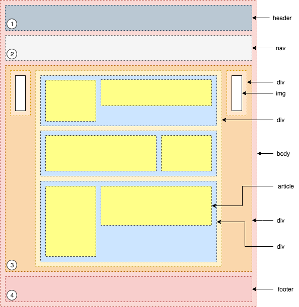
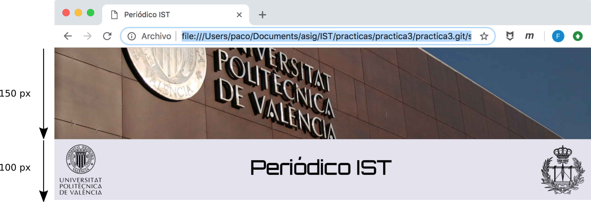
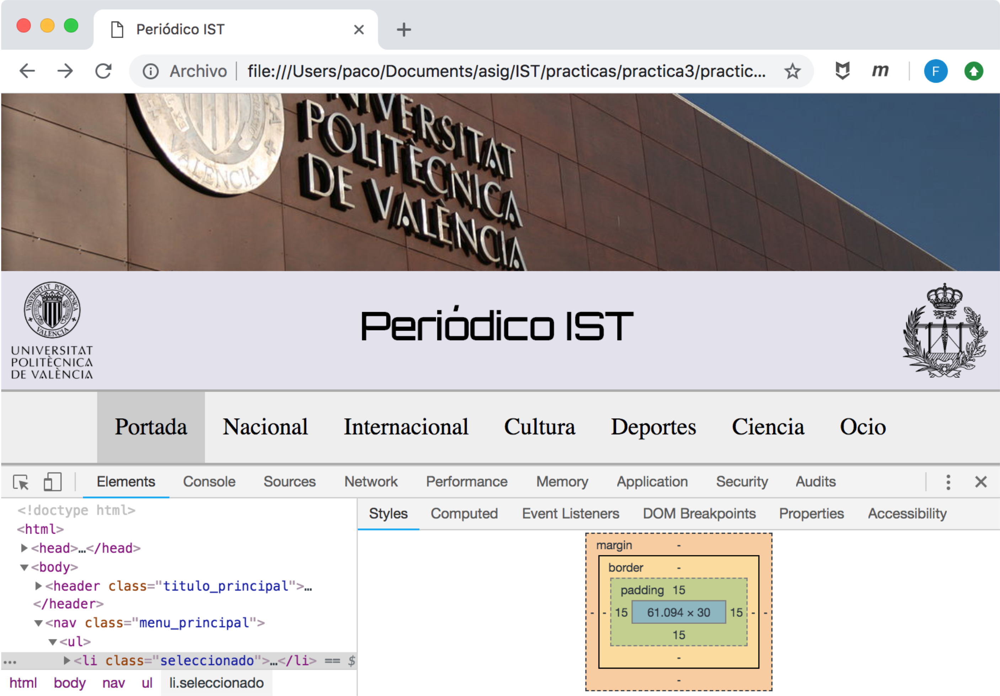
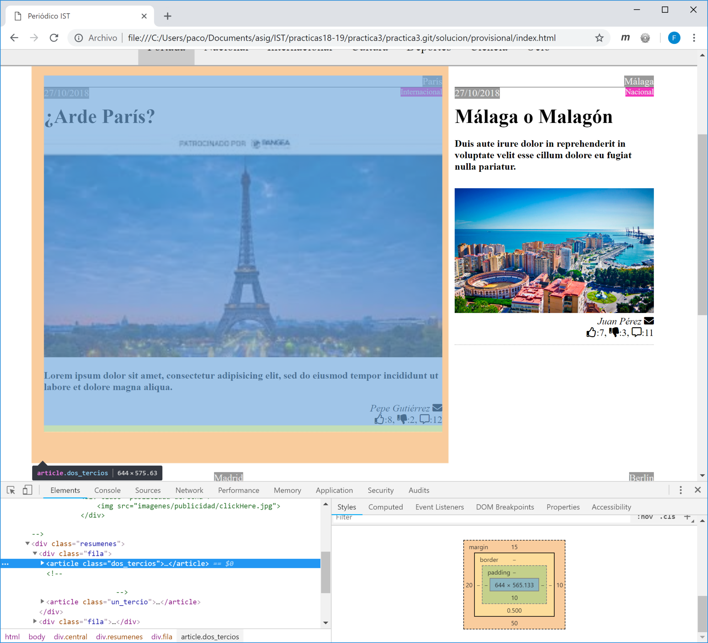
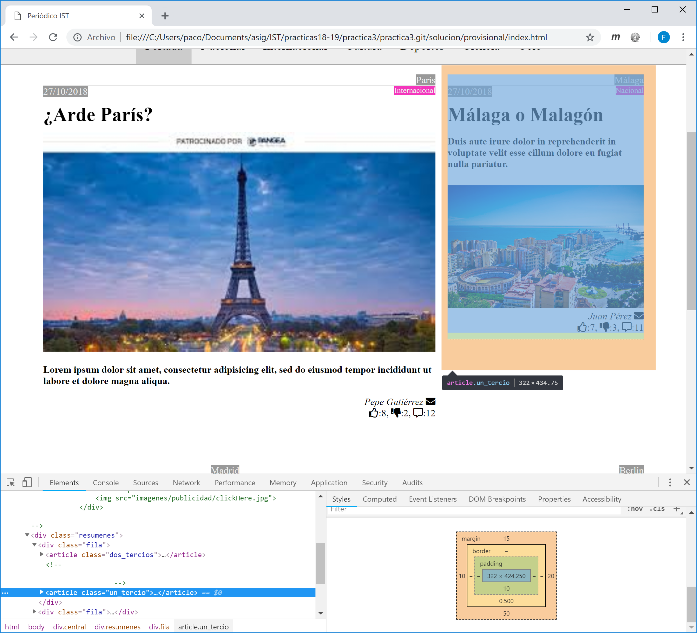
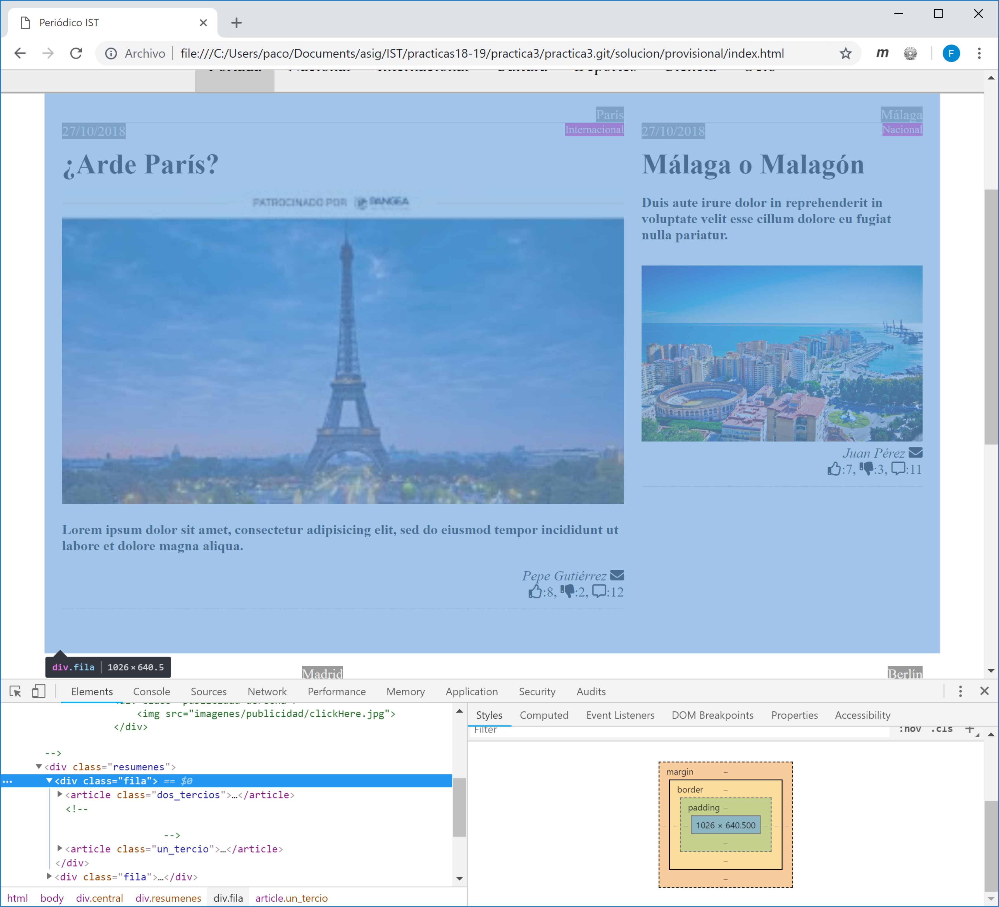
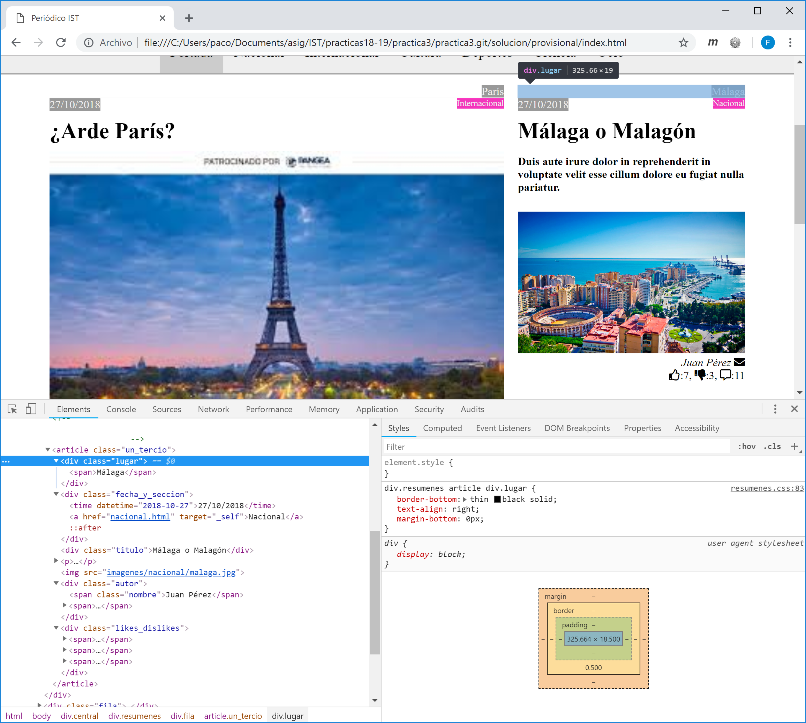

<h3 align="center">Práctica 3</h3>


<h1 align="center">Periódico digital I</h1>


<h2 align="center">Integración de Servicios Telemáticos</h2>
<h3 align="center">Máster Universitario en Ingeniería de Telecomunicación</h3>
<h3 align="center">ETSIT-UPV</h3>

<h4 align="center">Eva Antonino Daviu, F. J. Martínez Zaldívar</h4>


1.Introducción y objetivos
========================

En la presente práctica vamos a empezar a diseñar un sencillo periódico
digital de carácter estático. En subsiguientes prácticas se irán
completando algunas partes que quedarán pendientes de realizar.

Un objetivo importante es tratar de entender y proponer alternativas de
organización y estructura de la información asignando convenientemente
*clases* a distintos elementos HTML y atribuirles especificaciones CSS
concretas.

En esta serie de prácticas vamos a seguir utilizando lo estudiado en
clases de teoría. Aunque las especificaciones pueden ser incompletas,
deberían ser suficientes para conseguir un aspecto bastante similar a
las referncias gráficas que aquí aparezcan.

Durante el transcurso de la práctica el alumno podrá apreciar que una
misma idea puede implementarse de múltiples formas; por ello se pretende
que se reflexione sobre estas alternativas y elija la opción que le
parezca más conveniente, tratando de justificarla adecuadamente en forma
de comentarios dentro del código HTML.

Asímismo, es probable que deba consultar algunos detalles de
implementación todavía no impartidos en la asignatura; la intención de
ello es ejercitar y valorar oportunamente la competencia transversal de
*aprendizaje permanente*.

1.1. Organización de la práctica
---------------------------

Los grupos de prácticas pueden ser de uno o de dos alumnos. Se sugiere
que estos grupos sean estables a lo largo de todas las prácticas y esta,
especialmente, ya que tendrá continuidad y reaprovechamiento de todo el
trabajo realizado para la siguiente.

Se dedicará una sesión de dos horas para la realización de la presente
práctica.

Algunos ficheros (imágenes, por ejemplo) son proporcionados como
complemento al enunciado de la práctica, estando ubicados en
subdirectorios con nombres fáciles de identficar.


Algunos ficheros (imágenes, por ejemplo) y algunos directorios son proporcionados como complemento al enunciado de la práctica, para mantener todos una estructura homogénea, estando ubicados en el subdirectorio `web`.

1.2. Material necesario
------------------

El material necesario para llevar a cabo la práctica será un ordenador
de sobremesa o un portátil, con cualquier sistema operativo
convencional, un editor de texto plano y un navegador (preferiblemente
alguno que posea y del que se conozcan y manejen capacidades de
depuración).

Muy probablemente será necesario consultar informción de HTML5 y CSS.
Recuérdese que un sitio bastante útil es , entre otros.


2.Estructura general y contenidos
===============================

La práctica consistirá en diseñar un sitio web que represente un
periódico digital sencillo. Estará compuesto por un documento HTML
principal denominado que denominaremos simbólicamente *portada*, junto
con una serie de documentos HTML que harán las veces de páginas
dedicadas a las secciones del periódico. Para todas las páginas del
sitio web, el título de todas ellas, es decir, el contenido de la
etiqueta `title`, será: `Periódico IST`.

En la
figura 1 se muestra simbólicamente la
estructura gráfica de los contenidos que se desea para la *portada*, es
decir, para el documento `index.html`, el cual se detallará un poco más
adelante. Las páginas asociadas al desarrollo de cada una de las
secciones de las que consta el periódico tendrán una distribución
sutilmente distinta, lo cual se abordará en la siguiente práctica.


<p align="center">

</p>
<h4 align="center">Figura 1. Estructura de la <em>portada</em></h4>


Cualquier declaración de estilo que pueda aplicarse a todas las páginas
web del sitio web y que no sea específica de alguna parte concreta de
las mismas, debería estar en el fichero `css/estilo_gen.css`.

2.1. Portada
-------

El contenido de lo que denominamos *portada* estará ubicado en el
documento `index.html` tal y como se ha comentado anteriormente. Grosso
modo consistirá en cuatro partes o bloques principales, tal y como se
muestra en la
figura 1:

1.  Una *cabecera*, dentro de un elemento HTML `header`

2.  Un *menú de navegación*, dentro de un elemento HTML `nav`

3.  Una parte *central*, dentro de un elemento HTML `div`

4.  Un *pie*, en un elemento HTML `footer`

Estas cuatro partes se detallan en las siguientes secciones. Para que
todo esté razonablemente organizado, se sugiere que para cada una de
estas partes exista un fichero de estilo por separado, cuyos nombres se
especificarán en cada apartado y que, evidentemente, dichos ficheros
sean cargados o enlazados oportunamente.

### 2.1.1. Cabecera de portada 

La cabecera de la portada
(figura 2) constará de cuatro partes:

-   Una imagen corporativa de la UPV

-   Un título bajo la imagen anterior: `Periódico IST`

-   Dos logos a ambos lados del título anterior: uno de la UPV y otro de
    la ETSIT

La figura 2 muestra el resultado deseado.


<p align="center">

</p>
<h4 align="center">Figura 2. Cabecera de la _portada_</h4>


Guárdese todo el conjunto de especificaciones de estilo que se describan
para esta parte, en el fichero `css/cabecera.css`, y enlácese
oportunamente.

 

-   Según las indicaciones de la
    figura 1, el elemento `header` es hijo de
    `body`. A partir del aspecto de la
    figura 2, aparentemente el valor de los márgenes en
    `header` es nulo; probablemente haya que considerarlo desde `body`
    para poder conseguirlo.

-   Imagen corporativa de la UPV

    -   Para conseguir el aspecto que aparece en la
        figura 2, utilícese un `div` cuyo fondo o
        *background* sea el fichero `imagenes/logos/upv2.jpg`

    -   Las dimensiones de dicho `div` deberían ser de 150 px de altura

    -   Determínense correctamente los valores de las propiedades
        `background-repeat`, `background-size` y `background-position`
        para que el aspecto sea el que aparece en la
        figura 2.

-   Enciérrese el título (`Periódico IST`) en un elemento `h1` con las
    siguientes consideraciones:

    -   El color de fondo para este elemento `h1` debería ser `#e3e1ec`

    -   Debería tener una altura de 100 px

    -   El texto debe estar centrado horizontalmente

    -   Debería estar centrado también verticalmente (contémplese el uso
        de la propiedad CSS `line-height`) con el valor oportuno

    -   Utilícese la fuente `Orbitron` que podrá encontrarse en [Google Fonts](https://fonts.google.com/)

    Obsérvese que no hay espacio entre esta región y la imagen
    corporativa anterior: considérese el valor oportuno para la
    propiedad `margin`.

-   Logos: considérese emplear para ellos la propiedad CSS `float` con
    los valores oportunos. Recuérdese cómo interactuaban los elementos
    con cierto valor de *flotabilidad* con aquellos que no la tenían,
    para reconsiderar el orden en el que deben aparecer en el documento
    HTML.

    Por cuestiones estéticas, quizá haya que retocar algún parámetro del
    modelo de caja en alguno o algunos de los logos, aunque eso de deja
    a libre elección del alumno.

### 2.1.2. Menú de navegación

El elemento `nav` contendrá información sobre navegación en el sitio
web. Guárdense todas sus especificaciones de estilo en el fichero
`css/menu_principal.css` y enlácese oportunamente. Sus características
de estilo deberían ser:

-   Color de fondo `#EEE`

-   Borde superior e inferior con color `#AAA` de 2 px de anchura y
    estilo sólido

Contendrá una lista no ordenada (`ul`), con unas propiedades sugeridas
como las siguientes:

-   Sin relleno o *padding*

-   Tamaño de fuente: 20px

-   Contenido centrado

Respecto a cada uno de los ítems `li` contenidos por dicho elemento
`ul`, estos deberán estar dispuestos horizontalmente (y no verticalmente
tal y como les correspondería por el hecho de pertenecer a un elemento
`ul`; considérese la propiedad `display` para ello). También se requiere
que tengan un relleno de 15 px, una altura de contenido de 30 px, y para
que el texto que contenga esté centrado verticalmente, considérese la
propiedad `line-height` con el valor oportuno.

Si el ítem se corresponde con la página que se está visualizando (en el
caso de `Portada` sería `index.html`), entonces el color de fondo
debería ser ; en caso contrario no será necesario especificar ningún
color (heredará el del primer antecesor que tenga el color de fondo
especificado ---`nav` en nuestro caso---).

Cuando a alguno de estos elementos `li` se le pase el ratón por encima,
entonces deberá tener un color de fondo `#AAA`.

Cada uno de estos ítems `li` contendrá el nombre de las distintas
secciones del periódico y que serán:

-   Portada

-   Nacional

-   Internacional

-   Cultura

-   Deporte

-   Ciencia

-   Ocio

El contenido de cada ítem representará un hiper-enlace (atributo `href`
del elemento ancla `a`) respectivamente hacia:

-   `href="#"` (que denota este mismo documento). Desde cualquier otra
    sección, sería `href="index.html"`

-   `href="nacional.html"`

-   `href="internacional.html"`

-   `href="cultura.html"`

-   `href="deporte.html"`

-   `href="ciencia.html"`

-   `href="ocio.html"`

El texto de las anclas **no** deberá estar subrayados y deberá tener un
color negro.

De momento no será necesario *rellenar* todos y cada uno de estos
documentos HTML (a excepción de `index.html`, evidentemente).
Posteriormente se indicará cuál o cuáles de ellos hay que rellenar y de
qué manera, aunque sea parcialmente, para validar mínimamente el sitio
web.

Aparecerá algún tipo de separación física entre cada uno de los items de
los que consta el menú. Recuérdese de prácticas anteriores una forma
sencilla de evitar algún tipo de separación física o espacio entre los
distintos items.

Las figuras 3
y 4 representan el aspecto que se desea conseguir.


<p align="center">

</p>
<h4 align="center">Figura 3. Menú de navegación del sitio web</h4>


<p align="center">

</p>
<h4 align="center">Figura 4. Detalles de cada uno de los elementos del menú de navegación</h4>


Calcúlese y téngase en cuenta para consideraciones posteriores la altura
total de este menú de navegación: márgenes, bordes, rellenos y
contenidos del elemento `nav`, `ul` y `li`, tal y como aparece en la
parte izquierda de la
figura 3.

Un último detalle a tener en cuenta: ábrase el *inspector* del
navegador, seleccionando el elemento `body` observando su modelo de
caja. Estréchese la anchura de la ventana de navegación, observando el
momento en el que el menú o alguna parte anterior, estéticamente pierde
consistencia (por ejemplo que los ítems del menú de navegación requieren
dos líneas en vez de una, y supongamos que no deseamos dicho efecto).
Anótese la anchura para la que aproximadamente esto ocurre (no es
necesario que sea algo exacto, sino aproximadamente y redondeando hacia
arriba alguna que otra decena de píxeles). Esa cantidad debería ser la
anchura mínima (propiedad `min-width`) del elemento `body` que debería
respetarse (por debajo de la cual, ya aparece una visión parcial de la
página y barras de desplazamiento horizontal). Ajústese dicho valor y
obsérvese el efecto conseguido.

### 2.1.3. Parte central

La parte que podemos calificar de *central* contendrá varios objetos:
publicidad a ambos lados y resúmenes de las noticias con cierto
contenido estructurado, tal y como puede observarse en la
figura 1.

La sugerencia en cuanto a estructura es, siguiendo esta
figura 1, la siguiente:

-   Un `div` englobará tanto a la publicidad del lado izquierdo, los
    resúmenes y la publicidad del lado derecho

-   Otro `div` incluido en el anterior englobará a todos los resúmenes

-   Tendremos un `div` por cada fila de resúmenes

-   Cada fila de resúmenes incluirá dos resúmenes de artículos con
    cierta estructura interna

De momento, dejaremos de un lado la publicidad lateral y nos centraremos
en el conjunto de resúmenes y su distribución.

 

 

Todas las declaraciones de estilo referentes a esta parte se incluirán
en el fichero `css/resumenes.css`. La
figura 5 refleja de alguna manera el resultado
comentado, pudiendo observar la estructura de filas de resumenes y
resúmenes utilizando elementos `article` para ello, así como algunas
propiedades CSS en el modelo de caja.


<p align="center">

</p>
<h4 align="center">Figura 5. Resúmenes</h4>


En este figura se observa cómo el `div` de la clase `resumenes` incluye
dos `div` de la clase `fila`. Para el primer `div` de la clase `fila` se
observa, a su vez, la inclusión de dos elementos `article` que conforman
los dos resúmenes de artículos dispuestos en cada fila; el primero de
ellos pertenece a la clase `dos_tercios` y el segundo a `un_tercio` para
que una regla CSS le asigne la anchura oportuna, tal y como
posteriormente se comentará.

En las figuras 6
y 7 pueden observarse algunos detalles de los dos
resúmenes que conforman la primera fila
(figura 8).


<p align="center">

</p>
<h4 align="center">Figura 6. Primer resumen de artículo</h4>


<p align="center">

</p>
<h4 align="center">Figura 7. Segundo resumen de artículo</h4>


<p align="center">

</p>
<h4 align="center">Figura 8.Fila con los dos resúmenes de artículos</h4>


<p align="center">

</p>
<h4 align="center">Figura 9. Aspecto de la fila inferior de resúmenes</h4>


Algunos detalles sobre cómo se ha estructurado internamente el resumen
del artículo dentro del elemento `article` pueden encontrarse en la
figura 10, donde puede apreciarse cómo se ha
decidido estructurar el lugar de la noticia, la fecha y la sección a la
que pertenece, junto con el titular, un resumen y fotografía (o al
revés), y luego el nombre del autor, junto con un sobre denotando una
dirección de email y al final en la última línea, un pulgar hacia
arriba, uno hacia abajo y un bocadillo de comentarios acompañados de
sendos números indicando la cantidad de elementos de cada uno de ellos.


<p align="center">

</p>
<h4 align="center">Figura 10. Detalle del segundo resumen de artículo ---dentro de `article`---</h4>


Algunos comentarios detallados sobre la información que aparece en las
figuras anteriores son los siguientes:

-   El elemento `div` que incluirá los `div` que a su vez incluyen a las
    filas del par de resúmenes de artículos tendrá un margen izquierdo y
    derecho de 50 px (en ese hueco, ya se observará cómo, se dispondrá
    la publicidad en la siguiente práctica); véase la
    figura 5.

-   El elemento `div` que incluirá los dos resúmenes de artículos por
    fila es meramente organizativo y se empleará para identificar si
    estamos en la última fila o no, o si estamos hablando del primer o
    segundo artículo de la fila (véase la
    figura 8).

-   Un resumen de artículo se podrá realizar empleando el elemento
    `article`.

-   Para que se dispongan en la misma línea dos resúmenes de artículos,
    deberían tener una valor `inline` para la propiedad `display`, pero
    para poder especificar ciertas propiedades adicionales como ciertos
    márgenes, se sugiere que tome realmente el valor `inline-block` en
    vez del comentado inicialmente.

-   Ya que la intención es que los dos resúmenes de artículos estén
    alineados en su parte superior, considérese la propiedad
    `vertical-align` con su valor oportuno.

-   Cualquier resumen de artículo tendrá un margen superior de 15px,
    inferior de 50 px, y un relleno o *padding* inferior de 10 px (véase
    las figuras 6 y 7).

-   Si el resumen de artículo **no** está en la última fila de
    resúmenes, tendrá un borde inferior fino punteado y de color gris
    (figura 9).

-   Los contenidos de los dos resúmenes de artículos de una misma fila
    estarán separados entre ellos por 20 px (10 px + 10 px). La
    separación o margen entre el flanco izquierdo del contenido primer
    artículo y su contenedor `div` deberá ser de 20 px, y la de entre el
    flanco derecho del contenido del segundo artículo y su contenedor
    `div` deberá ser de nuevo de 20 px. Resumiendo, en una fila, el
    espacio disponible donado por el padre (`div` en este caso) se puede
    indicar en CSS como del `100%`; de este total emplearemos 60 px en
    márgenes *horizontales* siendo el espacio restante el que habrá que
    repartir en dos fracciones: 1/3 y 2/3.

-   El espacio que le correspondería a un resumen de artículo que
    deseara consumir una fracción del espacio disponible se puede
    calcular explícitamenten en CSS mediante la función `calc`. Por
    ejemplo. Si deseamos la cuarta parte del espacio disponible,
    eliminando, por ejemplo 24 píxeles de márgenes (el espacio
    disponible sería el del contenedor padre y vendría denotado por el
    100%) sería:

    ```css
        article { 
            width: calc((100% - 24px)/4); 
        }
    ```

    **Importante:** debe prestarse especial atención a los operadores
    aditivos (sumas o restas) en el argumento de la función `calc`, pues
    requieren **espacios** a su alrededor, es decir, si escribiéramos

    ```css
        article { 
            width: calc((100%-24px)/4); 
        }
    ```

    se interpretaría **incorrectamente**. También es necesario emplear
    unidades en todos los sumandos (`%` y `px` en el ejemplo).

    Dadas las circunstancias (márgenes previstos, anchura heredada del
    padre y fracción deseada), calcúlese cuál debería ser el valor
    calculado para la propiedad `width` del contenido de los resúmenes
    de artículos (elementos `article`) que vayan a emplear tanto 1/3
    como 2/3 del espacio disponible.

    **Importante**: Es muy probable que con estos cálculos se observe
    que los dos resúmenes de artículos se extiendan en dos líneas o
    filas, lo cual no es el objetivo. Si los cálculos de anchura están
    correctamente hechos (considerando correctamente los márgenes y la
    fracción), probablemente el motivo de este desajuste será el espacio
    que hay entre los elementos `article`, en cuyo caso, si no dejamos
    ningún tipo de separación (espacios en blanco, tabuladores, saltos
    de línea) entre los mismos, dentro del documento HTML, el problema
    estaría probablemente resuelto (del mismo modo, se puede intercalar
    un comentario entre ambos para conseguir el mismo efecto); este
    fenónmeno ya se ha observado en circunstancias parecidas
    anteriormente.

A continuación se exponene algunas directrices para estructura
internamente el elemento `article` que incluye el resumen del artículo.
Las partes de un resumen de artículo debería contener los siguientes
apartados:

-   Lugar

-   Fecha

-   Sección a la que correspondería (Nacional, Internacional, Deporte,
    ...)

-   Titular

-   Fotografía

-   Resumen (o resumen y después fotografía, indistintamente)

-   Autor y enlace a dirección de correo electrónico mediante el símbolo
    indicado con el sobre (posteriormente se darán indicaciones para
    conseguir dibujarlo)

-   Número de *likes*, *dislikes* y comentarios con los símbolos
    indicados

Los símbolos correspondientes a los últimos apartados comentados pueden
encontrarse, así como su forma de uso, entre otros sitios, en
[W3Schools-Icons](https://www.w3schools.com/icons/default.asp), donde se muestran algunas
familias de iconos como Awesome 5 y 4, Bootstrap y Google.

Inténtese imitar de alguna manera la geometría de todos los componentes
citados dentro del resumen.

### 2.1.4. Pie

El pie de cualesquiera página web del sitio web estará inscrito en un
elemento `footer` albergando dos elementos:

-   Una línea horizontal (elemento `hr`)

-   Un elemento `details` conteniendo un elemento `summary` cuyo
    contenido será `Créditos`, y una lista con tantos nombres y emails
    como alumnos conformen el grupo (algo similar a lo realizado en
    prácticas anteriores)

Resultados a entregar y operativa para la siguiente práctica
============================================================

De la misma forma que en prácticas anteriores, los resultados pueden
dejarse en GitHub en el repositorio compartido a tal efecto, o bien en
el espacio compartido de Poliformat.

-   GitHub: será necesario indicar un *tag* en el último *commit* de la
    sesión de prácticas con el texto `"P3_prov"`. Tras el período
    indicado posteriormente en el que se podrá completar alguna parte, o
    realizar modificaciones o mejoras, el último *commmit* será
    etiquetado con el texto `"P3_def"`.

    En la siguiente práctica se extenderán algunas ideas por lo que
    aprovecharemos todo lo realizado en esta, continuando en el mismo
    repositorio, simplemente añadiendo nuevos *commits*.

-   Poliformat: entrega de todos los ficheros en un fichero denominado
    `p3.zip` bajo el directorio `P3_prov` al finalizar la sesión de
    prácticas. Tras finalziar el período indicado a continaución en el
    que se podrá completar alguna parte, o realizar modificaciones o
    mejoras, el nuevo fichero `p3.zip` se incluirá en el directorio
    denominado `P3_def`.

Dada la excepcionalidad de la semana en la que se ha previsto la
realización de esta práctica se dispondrá de un total de 7 días (9 para
GitHub) para entregar los resultados.
